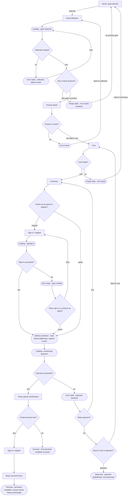
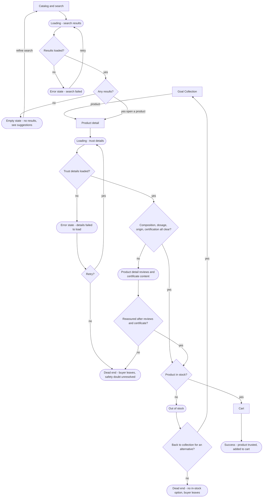
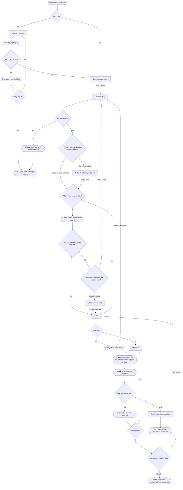
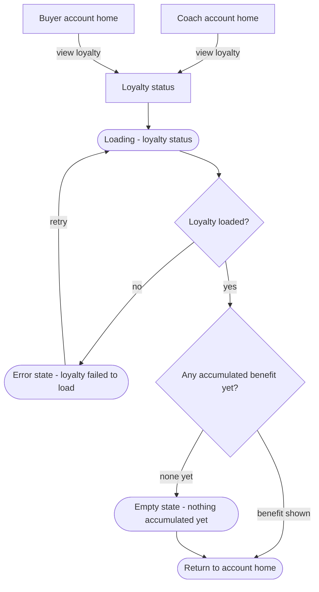

# User Flows

**Product:** Stack - mobile-first sport nutrition e-commerce, Ukraine
**Version:** v0.3 (2026-06-21)
**Language:** English (markdown research file)
**Depends on:** research/sitemap.md v0.6 (IA: screens, navigation, registered states), research/jtbd.md v1.2, research/strategy.md v5
**All screen, state, and in-flow step nodes are registered in sitemap.md Section 3. No node appears that is not registered there. Under Question entities and [post-launch] items do not appear.**

---

## Changelog

| Version | Date | Change |
|---------|------|--------|
| v0.1 | 2026-06-20 | Four Mermaid flows: Main Job (coach), Job 2 (beginner goal-to-product), Job 3 (safety verification), Job 4 (one-tap reorder). Decisions, states, and dead ends drawn, not only happy paths. |
| v0.2 | 2026-06-21 | IA corrective pass. Main flow: returning-coach sign-in branch, recoverable verification, Add client capture closes the create-client step (qE gate removed), bounded coach-price loop, substitute runs the stock and price checks, out-of-stock skips the line, untagged line can be discarded, Client profile review step, address selection, payment back-to-cart. Job 2/3/4: added missing empty/loading/error states, one-tap reorder from Order history rows, reviews-and-certificate recovery, payment back-to-cart, out-of-stock recovery. All new nodes registered in sitemap.md v0.5 first. |
| v0.3 | 2026-06-21 | Added a fifth flow, Job 6 Loyalty review (Loyalty status reachable from Coach account home and Buyer account home, with loading/empty/error states), so the Job 6 mark on Loyalty status is backed by a real flow node. States registered in sitemap.md v0.6 first. |

---

## Conventions

- `["Screen name"]` is a screen. Every screen name is taken verbatim from sitemap.md Section 3.
- `{"question?"}` is a decision point with labeled branches.
- `(["State - ..."])` is a state, a start point, a success end, or a dead end. States use the fixed vocabulary (empty, loading, error, out of stock) plus the in-session steps registered in sitemap.md Section 3 (Add client capture, Choose substitute, address selection, coach price unresolved, reviews and certificate content). No node here is unregistered.
- The coach adds products through quick-add inside Multi-client order session, not through the global Catalog and search.
- Dead ends are terminal and deliberate. A recoverable problem routes back (retry, skip line, discard line, back to cart, resubmit link), never to a terminal.

---

## Main Job - coach builds a multi-client order in one session and receives the goods reliably (Main JTBD, Decision 1)

Primary persona: Olena. This is the deepest flow by design (it is a work flow). It covers sign-in for an existing coach, sign-up and verification for a new coach, per-client order history review, client creation, the per-client ordering loop with out-of-stock and price recovery, and the purchase.

```mermaid
flowchart TD
    s0(["Coach opens Stack"])
    q1{"Logged in as verified coach?"}
    qacct{"Have an account?"}
    e1["Sign in / register"]
    slog(["Loading - signing in"])
    qauth{"Sign in successful?"}
    serr(["Error state - sign in failed"])
    qretrylogin{"Retry sign in?"}
    c1["For Coaches page + published pricing"]
    c2["Coach sign-up + social-link verify"]
    svrf(["Loading - verifying social link"])
    q2{"Verification passed?"}
    evf(["Error state - verification failed, resubmit link"])
    qresub{"Resubmit link?"}
    de1(["Dead end - verification not passed, no coach access"])
    c3["Coach account home"]
    c5p["Client profile"]
    cpl(["Loading - client order history"])
    qcp{"Client history loaded?"}
    cperr(["Error state - client history failed to load"])
    qcphas{"Any orders for this client?"}
    cpempty(["Empty state - nothing ordered for this client yet"])
    c4["Multi-client order session"]
    q3{"Client already in list?"}
    c5["Client list"]
    addc(["Add client capture - name and goal"])
    slqa(["Loading - quick-add catalog and coach-tier price"])
    q4{"Product in stock?"}
    so1(["Out of stock"])
    q5{"Substitute available?"}
    csub(["Choose substitute"])
    q7{"Coach-tier price applied?"}
    ee1(["Error state - coach price not applied"])
    qprice{"Retry or stop?"}
    blockc(["Coach price unresolved - session saved, checkout blocked"])
    q6{"Order line tagged to client?"}
    su1(["Untagged line - assign a client"])
    qtag{"Assign client or discard line?"}
    q8{"More clients to order for?"}
    c6["Cart"]
    qce{"Cart empty?"}
    ec(["Empty state - cart empty"])
    c7["Checkout"]
    addr(["Address selection - read Saved addresses, capture if none"])
    sl1(["Loading - processing payment"])
    q9{"Payment successful?"}
    ep1(["Error state - payment declined"])
    q10{"Retry payment?"}
    qaband{"Back to Cart or abandon?"}
    de3(["Dead end - payment abandoned, cart preserved"])
    c8["Order placed confirmation"]
    ok1(["Success - multi-client order placed and confirmed"])

    s0 --> q1
    q1 -->|yes| c3
    q1 -->|no| qacct
    qacct -->|yes| e1
    e1 --> slog
    slog --> qauth
    qauth -->|yes| c3
    qauth -->|no| serr
    serr --> qretrylogin
    qretrylogin -->|yes| e1
    qretrylogin -->|no| qacct
    qacct -->|no| c1
    c1 --> c2
    c2 --> svrf
    svrf --> q2
    q2 -->|yes| c3
    q2 -->|no| evf
    evf --> qresub
    qresub -->|yes| c2
    qresub -->|no| de1
    c3 -->|review client history| c5p
    c5p --> cpl
    cpl --> qcp
    qcp -->|no| cperr
    cperr -->|retry| cpl
    qcp -->|yes| qcphas
    qcphas -->|orders shown| c4
    qcphas -->|none yet| cpempty
    cpempty --> c4
    c3 -->|new order| c4
    c4 --> q3
    q3 -->|yes| slqa
    q3 -->|no| c5
    c5 --> addc
    addc -->|client added and selected| slqa
    slqa --> q4
    q4 -->|no| so1
    so1 --> q5
    q5 -->|no skip line| q8
    q5 -->|yes| csub
    csub --> q4
    q4 -->|yes| q7
    q7 -->|no| ee1
    ee1 --> qprice
    qprice -->|retry| q7
    qprice -->|stop| blockc
    blockc --> c3
    q7 -->|yes| q6
    q6 -->|no| su1
    su1 --> qtag
    qtag -->|assign| q6
    qtag -->|discard line| q8
    q6 -->|yes| q8
    q8 -->|yes| q3
    q8 -->|no| c6
    c6 --> qce
    qce -->|yes| ec
    ec --> c4
    qce -->|no| c7
    c7 --> addr
    addr --> sl1
    sl1 --> q9
    q9 -->|yes| c8
    q9 -->|no| ep1
    ep1 --> q10
    q10 -->|yes| c7
    q10 -->|no| qaband
    qaband -->|back to cart| c6
    qaband -->|abandon| de3
    c8 --> ok1
```

- **Decision points:** logged in as verified coach; have an account; sign in successful; retry sign in; verification passed; resubmit link; client history loaded; any orders for this client; client already in list; product in stock; substitute available; coach-tier price applied; retry or stop coach price; order line tagged to client; assign client or discard line; more clients to order for; cart empty; payment successful; retry payment; back to cart or abandon.
- **States:** loading (signing in); error (sign in failed); loading (verifying social link); error (verification failed, resubmit link); loading (client order history); error (client history failed to load); empty (nothing ordered for this client yet); Add client capture (name and goal); loading (quick-add); out of stock; Choose substitute; error (coach price not applied); coach price unresolved (session saved, checkout blocked); untagged line; empty (cart empty); address selection; loading (processing payment); error (payment declined).
- **Dead ends (terminal, deliberate):** verification not passed and resubmit declined (no coach access; unfixable case only); payment abandoned (cart preserved).
- **Recoveries that replaced former dead ends:** out-of-stock with no substitute now skips the line and continues (was a hard dead end); the coach-price loop is bounded by retry-or-stop, where stop saves the session, returns to Coach account home, and blocks checkout until the coach-tier price resolves (was an infinite loop); an untagged line can be discarded; payment declined can return to Cart with contents preserved; an existing logged-out coach has a sign-in path; a fixable verification failure can resubmit the link.
- **Success:** multi-client order placed and confirmed. Each additional client loops back through the client and quick-add steps (breadth), not deeper screens.

---

## Job 2 - beginner goal-to-product first purchase, guest checkout then guest to account (Job 2, Decision 2; account offer per Decision 3/4)

Secondary persona: Viktoriia. The purchase entry is guest (no forced account). The account is offered after the order, because order history and loyalty need an account.

Note: `b6` and `b6b` are the same screen (Sign in / register) in two contexts: before checkout (optional early register) and on the confirmation (the guest to account offer).

- **Decision points:** collection loaded; any in-stock products; product in stock; cart empty; check out as guest or register; sign in successful; retry sign in or continue as guest; payment successful; retry payment; back to cart or abandon; create account now.
- **States:** loading (goal collection); error (collection failed to load); empty (no in-stock products); out of stock; empty (cart empty); loading (signing in); error (sign in failed); address selection; loading (processing payment); error (payment declined).
- **Dead ends (terminal, deliberate):** payment abandoned (cart preserved).
- **Recoveries:** an empty or failed collection routes back to the goal selector; a failed sign-in at checkout can retry or fall back to guest; payment declined can return to Cart with contents preserved.
- **Success:** two ends, both valid. Guest end (purchase complete, no saved history or loyalty) and account end (purchase complete, history and loyalty saved via Buyer account home).

---

## Job 3 - verify product safety before buying (Job 3)

The buyer reads composition, dosage, origin, and certification on Product detail before deciding. If still unsure, the same screen offers reviews and certificate content before the buyer leaves. Entry is from either Goal Collection or Catalog and search.

- **Decision points:** results loaded; any results; trust details loaded; retry; composition/dosage/origin/certification all clear; reassured after reviews and certificate; product in stock; back to collection for an alternative.
- **States:** loading (search results); error (search failed); empty (no results, see suggestions); loading (trust details); error (details failed to load); reviews and certificate content; out of stock.
- **Dead ends (terminal, deliberate):** buyer leaves with safety doubt unresolved after seeing reviews and certificate content (accepted lost sale, stated plainly, not masked); no in-stock option and the buyer leaves.
- **Recoveries:** an unconvinced buyer is routed to same-screen reviews and certificate content before any leave; a sold-out product routes back to the collection for an alternative.
- **Backlog:** back-in-stock notify for the sold-out product (post-launch stockout reminder, Decision 4).
- **Success:** product is trusted and added to Cart.

---

## Job 4 - one-tap reorder from order history (Job 4, Decision 4)

Supporting persona: Andriy. He repeats a previous order in one tap directly from an Order history row. He must be signed in to have an order history.

- **Decision points:** logged in; sign in successful; retry sign in; any past orders; repeat from history row or open order detail; all previous items in stock; remove unavailable and continue; back to order history or search the item; cart empty; payment successful; retry payment; back to cart or abandon.
- **States:** loading (signing in); error (sign in failed); empty (no past orders to repeat); out of stock (one or more staples); empty (cart empty); address selection; loading (processing payment); error (payment declined).
- **Dead ends (terminal, deliberate):** payment abandoned (cart preserved). Empty order history is a soft exit to the shopping path (Home / goal selector), not a hard dead end.
- **Recoveries:** one-tap repeat fires directly from an Order history row without opening Order detail (XD-1, Decision 4); an out-of-stock staple routes back to Order history or to Catalog and search to find it another way (was a hard dead end); payment declined can return to Cart with contents preserved.
- **Backlog:** back-in-stock notify for the wanted out-of-stock staple (post-launch stockout reminder, Decision 4).
- **Success:** staples reordered in one tap and confirmed.

---

## Job 6 - Loyalty review, coach primary and regular secondary (Job 6, Decision 3)

Olena (primary) and Andriy (secondary) open a read-only view of the price benefit their volume has accumulated. This is a review screen (enter, see, exit), with no action branches and no loyalty mechanics drawn (thresholds and percentages are [?]). It is reachable from both account homes so the Job 6 mark on Loyalty status is backed by a real flow node.

- **Decision points:** loyalty loaded; any accumulated benefit yet.
- **States:** loading (loyalty status); error (loyalty failed to load); empty (nothing accumulated yet).
- **Dead ends:** none. This is a read-only review; every path returns to the account home the coach or regular came from.
- **Success:** the accumulated volume-based price benefit is shown (or the empty state if nothing is accumulated yet), then the user returns to the account home. No thresholds or percentages are drawn; loyalty numbers remain [?].

---

## Integrity check

- Every screen node in all five flows is a confirmed screen in sitemap.md Section 3: Home / goal selector, Goal Collection, Catalog and search, Product detail, Cart, Checkout, Order placed confirmation, For Coaches page + published pricing, Coach sign-up + social-link verify, Coach account home, Client list, Client profile, Multi-client order session, Order history, Order detail + Repeat order, Sign in / register, Buyer account home, Loyalty status.
- Every state and in-session step node is registered in sitemap.md Section 3 "Registered screen states and in-flow steps": Add client capture, Choose substitute, address selection, coach price unresolved, reviews and certificate content, Loyalty status loading/empty/error (added v0.6), and the loading / error / empty / out-of-stock states per screen. No node here is unregistered (no ghost screens, no ghost states).
- No Under Question entity (referral link, adherence tracker, paid subscription, client portal, invoice export) and no [post-launch] item (guided quiz, My Staples list, stockout email reminder) appears in any flow.
- Dead ends are terminal and deliberate; every recoverable problem routes back.

## Backlog (deliberately out of MVP, with reason)

- Manual moderation of coach verification: no manual review desk in MVP, so a verification that cannot be fixed by resubmitting the link stays an explicit dead end (de1 in the Main flow). Revisit if auto-verification proves too strict.
- In-app support contact from the coach price-unresolved state: no in-app support desk in MVP; the MVP behaviour is save-session-and-block-checkout (blockc in the Main flow). Add a support path when a support channel exists.
- Back-in-stock notify (a wanted out-of-stock staple in reorder; a sold-out product in safety verification): the post-launch stockout reminder (Decision 4, entity E10), kept out of MVP.

---

## Sources

- research/sitemap.md v0.6 (IA: entities, screens, navigation, registered states, traceability)
- research/jtbd.md v1.2
- research/strategy.md v5
- research/personas.md v1.2
