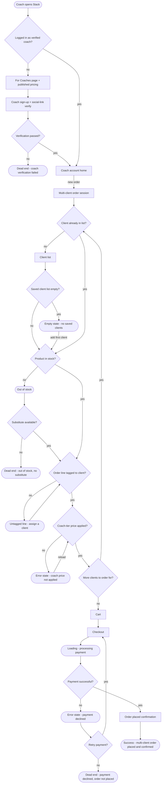
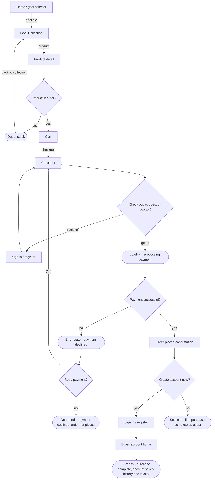
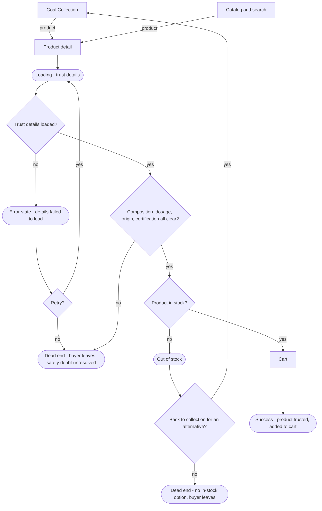
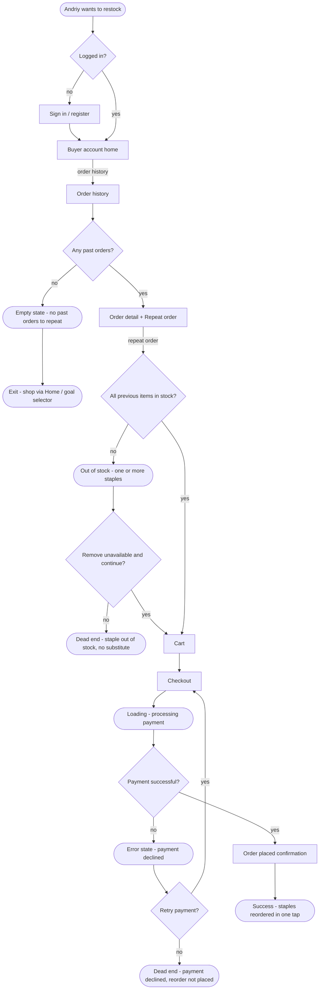

# User Flows

**Product:** Stack - mobile-first sport nutrition e-commerce, Ukraine
**Version:** v0.1 (2026-06-20)
**Language:** English (markdown research file)
**Depends on:** research/sitemap.md v0.3 (IA: screens + navigation), research/jtbd.md v1.1, research/strategy.md v4
**All screen node names match sitemap.md Section 3 exactly. No screen appears that is not in sitemap.md. Under Question entities and [post-launch] items do not appear.**

---

## Changelog

| Version | Date | Change |
|---------|------|--------|
| v0.1 | 2026-06-20 | Four Mermaid flows: Main Job (coach), Job 2 (beginner goal-to-product), Job 3 (safety verification), Job 4 (one-tap reorder). Decisions, states, and dead ends drawn, not only happy paths. |

---

## Conventions

- `["Screen name"]` is a screen. Every screen name is taken verbatim from sitemap.md Section 3.
- `{"question?"}` is a decision point with `-->|yes|` / `-->|no|` (or named) branches.
- `(["State - ..."])` is a state (empty, loading, error, out of stock), a start point, a success end, or a dead end. The state vocabulary is the set fixed in sitemap.md Section 3 (empty, loading, error, out of stock); no new state types are invented.
- The coach adds products through quick-add inside Multi-client order session, not through the global Catalog and search. Search is therefore not drawn in the coach flow.

---

## Main Job - coach builds a multi-client order in one session and receives the goods reliably (Main JTBD, Decision 1)

Primary persona: Olena. This is the deepest flow by design (it is a work flow). It covers onboarding for a new coach, the per-client ordering loop, and the purchase.

- **Decision points:** logged in as verified coach; verification passed; client already in list; saved client list empty; product in stock; substitute available; order line tagged to client; coach-tier price applied; more clients to order for; payment successful; retry payment.
- **States:** empty (no saved clients), out of stock, untagged line (must assign a client), error (coach price not applied), loading (processing payment), error (payment declined).
- **Dead ends:** coach verification failed; out of stock with no substitute; payment declined and not retried.
- **Success:** multi-client order placed and confirmed. Each additional client loops back through the client and quick-add steps (breadth), not deeper screens.

---

## Job 2 - beginner goal-to-product first purchase, guest checkout then guest to account (Job 2, Decision 2; account offer per Decision 3/4)

Secondary persona: Viktoriia. The purchase entry is guest (no forced account). The account is offered after the order, because order history and loyalty need an account.

Note: `b6` and `b6b` are the same screen (Sign in / register) in two contexts: before checkout (optional early register) and on the confirmation (the guest to account offer).

- **Decision points:** product in stock; check out as guest or register; payment successful; retry payment; create account now (guest to account).
- **States:** out of stock (returns to Goal Collection for an alternative); loading (processing payment); error (payment declined).
- **Dead ends:** payment declined and not retried.
- **Success:** two ends, both valid. Guest end (purchase complete, no saved history or loyalty) and account end (purchase complete, history and loyalty saved via Buyer account home).

---

## Job 3 - verify product safety before buying (Job 3)

The buyer reads composition, dosage, origin, and certification on Product detail before deciding. If the safety question is not answered, the buyer leaves (OBS-B5). Entry is from either Goal Collection or Catalog and search.

- **Decision points:** trust details loaded; retry; composition/dosage/origin/certification all clear; product in stock; back to collection for an alternative.
- **States:** loading (trust details); error (details failed to load); out of stock.
- **Dead ends:** buyer leaves with safety doubt unresolved; no in-stock option and the buyer leaves.
- **Success:** product is trusted and added to Cart.

---

## Job 4 - one-tap reorder from order history (Job 4, Decision 4)

Supporting persona: Andriy. He repeats a previous order in one tap. He must be signed in to have an order history.

- **Decision points:** logged in; any past orders; all previous items in stock; remove unavailable and continue; payment successful; retry payment.
- **States:** empty (no past orders to repeat); out of stock (one or more staples); loading (processing payment); error (payment declined).
- **Dead ends:** staple out of stock with no substitute; payment declined and not retried. Empty order history is a soft exit to the shopping path (Home / goal selector), not a hard dead end.
- **Success:** staples reordered in one tap and confirmed.

---

## Integrity check

- Every screen node in all four flows is one of the confirmed screens in sitemap.md Section 3: Home / goal selector, Goal Collection, Catalog and search, Product detail, Cart, Checkout, Order placed confirmation, For Coaches page + published pricing, Coach sign-up + social-link verify, Coach account home, Client list, Multi-client order session, Order history, Order detail + Repeat order, Sign in / register, Buyer account home.
- No new screen was needed, so sitemap.md Section 3 was not modified. If a later flow needs a screen that is not listed there, that screen is added to sitemap.md (IA) with a job tag first, and only then kept in a flow.
- No Under Question entity (referral link, adherence tracker, paid subscription, client portal, invoice export) and no [post-launch] item (guided quiz, My Staples list, stockout email reminder) appears in any flow.
- States are limited to the set fixed in sitemap.md Section 3: empty, loading, error, out of stock.

---

## Sources

- research/sitemap.md v0.3 (IA: entities, screens, navigation)
- research/jtbd.md v1.1
- research/strategy.md v4
- research/personas.md v1.2
